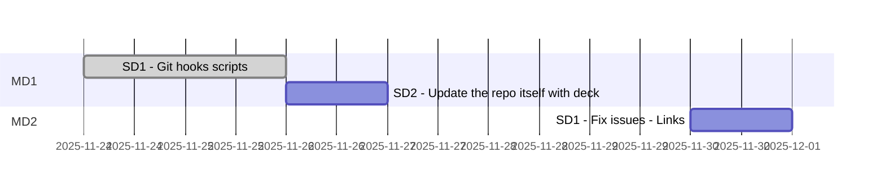

# Git hooks

Abbreviations
> * PM Product Milestone
> * MD Milestone division
> * SD Subdivision

## Analyzing all parts

|#|Part|Details|Total Duration|Status|
|:-|:-|:-|:-|:-|
|1|[Develop](%base_url%/pm#Develop_timeplan)|2025-11-26 - 2025-11-26|5 hours|DONE|
|2|[Maintenance](%base_url%/pm#Maintenance_timeplan)|2025-11-26 -|- hours|ONGOING|
|:-|:-|:-|::||

## Develop timeplan

# Stories/cards MD1 - Develop

## 48-002

### Goal : 
The goal of this card is to update the local repo itself with hooks.
It also aims to add a deck file to the repo

### DOD  (definition of done):
Hooks files are added to the local repo.
A Deck file is created for the progect

### TODO :
- [x] 1. Add git hooks' scripts
- [x] 2. Updated Deck path
- [x] 3. Add a deck file to the repo
- [] 4. Update time plan

### Reports :
* 

### Steps to test and debugging:
- [] 1.

### References :
* 

# Stories/cards MD2 - Maintenance

## 48-003

### Goal : 
It seems the link created by hooks does not work. The goal of this card is to find the problem and fix it.

### DOD  (definition of done):
Links created by git hook scripts work

### TODO :
- [] 1. Find wath the issue is
- [] 2. Fix it
- [] 3. Document findings

### Reports :
* 

### Steps to test and debugging:
- [] 1.

### References :
* 
